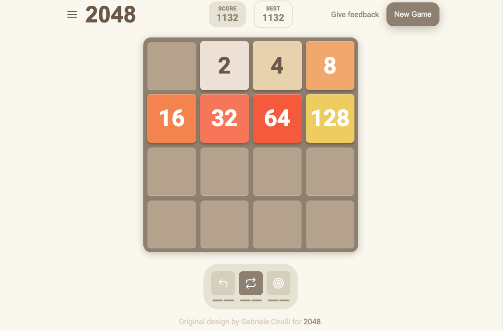

# 2048 Clone

This project is a design copy of the popular game **2048**, originally created by [Gabriele Cirulli](https://play2048.co/). The game features a grid where players slide tiles of numbers to combine them, aiming to reach the **2048** tile.

## Features
- Fully responsive design for both desktop and mobile.

## Technologies Used
- **HTML5**: Structure of the game interface.
- **CSS3**: For styling, including flexbox, grid layout, and media queries for responsiveness.

## Acknowledgements
- Original Game Design: [Gabriele Cirulli](https://play2048.co/)